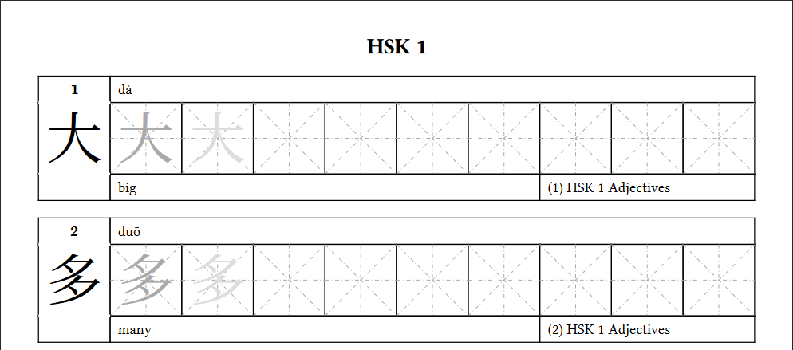

# HSK Worksheet Generator

A simple set of tools to automatically generate HSK worksheets as CSVs and PDFs files.

## Installation

Install all Python dependencies with:

```sh
poetry install
```

You will also need [Typst](https://typst.app/) installed and available on `PATH` to generate PDFs.

## Usage

All commands listed below should be issued from this project's root folder unless otherwise stated.

### Export Vocabulary as CSV

This application uses the excellent [AllSet Learning Chinese Vocabulary Wiki](https://resources.allsetlearning.com/chinese/vocabulary) as its default crawler data source. Other crawlers can be implemented as long as they generate the following fields for each scrapped item:

| Name     | Type | Description                                    |
| -------- | ---- | ---------------------------------------------- |
| id       | int  | Sequential ID of each item in a given category |
| category | str  | Name of the item category                      |
| chinese  | str  | Chinese word                                   |
| pinyin   | str  | Pinyin representation                          |
| english  | str  | English translation                            |

To extract HSK `1` vocabulary to a CSV file at `./output/hsk_1.csv`, you should run: 

```sh
scrapy crawl AllSetLearning -a hsk=1 -O ./output/hsk_1.csv
```

### Generate PDF from CSV

To generate a HSK `1` PDF file at `./output/hsk_1.pdf` from a given CSV vocabulary file located at `./output/hsk_1.csv`, you should run:

```sh
typst compile template/main.typ output/hsk_1.pdf
    --root .
    --font-path font
    --input hsk="1"
    --input csv_file_path="../output/hsk_1.csv"
```

The resulting PDF file should look like this:

